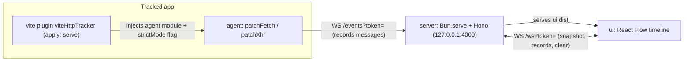

# AGENTS.md

Agent/LLM-oriented guide to the `vite-http-tracker` monorepo. Read this before changing code. It documents the architecture, the invariants the code depends on, and the conventions to follow. Keep it in sync with the code.

## What this project is

A developer-experience tool that captures the HTTP requests a running frontend app makes (the traffic you'd see in the browser Network panel) and renders them as a **time-ordered**, interactive graph on a separate port. It runs as a sidecar — one server on `:4000`, one WebSocket-fed agent injected into the tracked app — plus a React dashboard.

It is **local-first** (no auth, no external service) and **opt-in** (a Vite plugin injects the agent into a dev build automatically).

## Repo layout

Bun workspaces (`package.json` → `workspaces: ["packages/*", "apps/*"]`).

| Path | Role |
|---|---|
| `packages/shared` | `RequestRecord` type + constants. Imported by agent, server, UI. Types-only + constants. |
| `packages/agent` | Browser lib. Patches `fetch` + `XMLHttpRequest`, builds records, streams over WebSocket. |
| `packages/server` | Bun + Hono + native WebSocket. Ingests, stores, broadcasts, serves UI, CLI. |
| `packages/ui` | React 19 dashboard. React Flow timeline, filters, inspector, dedup/batch logic. |
| `packages/plugin` | Vite plugin `viteHttpTracker()`. Auto-injects agent, detects Strict Mode at build time. |
| `apps/react-app` | Sample Vite + React 19 app with per-scenario buttons. |
| `apps/vue-app` | Sample Vite + Vue 3 app for manual plugin verification. |
| `apps/solid-app` | Sample Vite + Solid app for manual plugin verification. |
| `apps/svelte-app` | Sample Vite + Svelte 5 app for manual plugin verification. |
| `apps/preact-app` | Sample Vite + Preact app for manual plugin verification. |
| `apps/vanilla-app` | Sample plain TypeScript Vite app for manual plugin verification. |
| `packages/ui/dist` | Built dashboard bundle, served by the server (SPA fallback). |

## Commands

```bash
bun install                        # install (workspace-aware)
bun test                           # run all tests (Bun test runner)
bunx tsc --noEmit -p <pkg>/tsconfig.json   # typecheck one package (each has its own config)
bunx oxlint packages apps          # lint (oxlint, config .oxlintrc.json)
bunx oxfmt --write packages apps   # format (oxfmt)
bun run --cwd packages/ui build    # build the dashboard bundle
bun run packages/server/src/cli.ts --no-open   # run the tracker server
bun run --cwd apps/react-app dev   # run the sample app
```

Typecheck is per-package: `packages/shared`, `packages/agent`, `packages/server`, `packages/ui`, `packages/plugin`, and all apps under `apps/` extend `tsconfig.base.json`. The root `tsconfig.json` only covers the Node/browser packages (it excludes `packages/ui` and `apps/*`, which have their own configs) because mixing a React app's TSX with Bun-only types causes unresolved-global errors.

## Architecture

The single canonical record type is `RequestRecord` in `packages/shared/src/types.ts`. It flows through all three layers.



### Layers and boundaries

- **Agent** (`packages/agent`): pure capture helpers (`capture.ts`), redaction (`redact.ts`), transport (`transport.ts`), and the DOM patches (`patch-fetch.ts`, `patch-xhr.ts`). `initAgent()` wires it together and owns the WS socket + reconnect. Only touches browser globals (`window`, `WebSocket`, `crypto`).
- **Server** (`packages/server`): `store.ts` (byte-LRU), `server.ts` (Hono + `Bun.serve` upgrade for `/ws` and `/events`, static serving of `ui/dist` with `public/` as dev fallback), `cli.ts` (`vite-http-tracker`). No React, no UI logic. Binds to `127.0.0.1`. Auth token required on every write and every WS upgrade.
- **UI** (`packages/ui`): pure graph logic in `src/graph.ts` (dedup, batches, layout, graph building — fully unit-tested, no React). React/React Flow components and TanStack Query hooks under `src/components/`, `src/hooks/`. Reads records from the query cache fed by the WS connection hook.
- **Plugin** (`packages/plugin`): `viteHttpTracker()` build-time plugin. `apply: "serve"`. Injects a virtual module (`virtual:vite-http-tracker/agent`) into `index.html` via `transformIndexHtml` and detects whether the app uses Strict Mode by scanning `src/` in `configResolved`.
- **Shared** (`packages/shared`): type + constants only. No runtime logic beyond constants.

## Data model (`RequestRecord`)

```ts
interface RequestRecord {
  requestId: string;      // uuid per record
  seq: number;            // monotonic order across the session
  method: string; url: string; status: number;
  startTime: number; endTime: number; duration: number;
  requestHeaders?: Record<string, string>;
  responseHeaders?: Record<string, string>;
  requestBody?: string; responseBody?: string;
  bodyTruncated?: boolean; opaque?: boolean; streaming?: boolean;
  bodySizeBytes?: number;
  requestHash?: string;   // stable hash(method+url+body) for dedup
  strictMode?: boolean;   // tagged by the agent from the plugin's build flag
  batchId?: string;       // same-turn (parallel) grouping
}
```

## Key invariants (do not break these)

- **Server binds `127.0.0.1` only.** Never change to `0.0.0.0`.
- **Token is required** on every ingest (`POST /events`) and every WS upgrade (`/events`, `/ws`). The agent must include `?token=<token>` in its WS URL — the server rejects upgrades without it. (This happened before.)
- **Agent must append the token** to its connect URL (`ws://…/events?token=…`). When `serverUrl` is unset, the agent derives the host from `window.location.hostname` (WSL/port-forwarding friendliness).
- **Caps:** response body `500_000` bytes (`DEFAULT_BODY_CAP`); store `128 MB` (`DEFAULT_STORE_BYTE_CAP`); agent ring buffer `10_000` records; dedup window `200ms` (`DUPLICATE_WINDOW_MS` in UI graph.ts); batch window `2ms` (`BATCH_WINDOW_MS`).
- **Redaction** of sensitive headers/fields: `authorization`, `cookie`, `set-cookie`, `x-api-key`, `x-auth-token`, `token`, `password`, `secret` → `[REDACTED]` (case-insensitive).
- **Request/response bodies** are only captured when safely re-readable. Skip `FormData`/`Blob`/`ReadableStream`/`ArrayBuffer`; mark streams `streaming: true`, size-over-cap `bodyTruncated: true`, unreadable/CORS `opaque: true`.
- **`crypto` is env-safe** via `newId()` in `capture.ts` — don't call `crypto.randomUUID()` directly in agent code.
- **Dedup and batch are heuristics, not guarantees.** `groupRecords` collapses identical `(method,url,hash)` within the dedup window (canonical = last); batches are requests whose `batchId` matches (>1 member ⇒ `⚡×N`). Edges are pure **chronological** (consecutive by `seq`), not causal.

## Conventions

- **Formatters/linters are oxlint + oxfmt** — run them (`bunx oxlint packages apps`, `bunx oxfmt --write packages apps`). This project does not use ESLint/Prettier.
- **No comments unless the "why" is non-obvious.** Prefer self-documenting code.
- **Explicit types on all exports; no `any`.** `strict` + `noUncheckedIndexedAccess: true` are on.
- **`verbatimModuleSyntax`** is on — use `import type { … }` for type-only imports.
- **Import with `.js` extension** in TS (e.g. `./graph.js`) for Bun/TS resolution.
- **Vite 8 + @vitejs/plugin-react v6** use the native Oxc React Compiler. The compiler is enabled with `react({ compiler: true })`; do **not** configure `babel: { plugins: ['babel-plugin-react-compiler'] }` — that only works on the old Babel toolchain.
- **happy-dom** is registered per-file in tests via `@happy-dom/global-registrator` (`beforeAll`/`afterAll`), not via a global `bunfig.toml` preload — a global preload breaks the server's real `fetch`. Tests that need the DOM use the registrator; Bun test runs each file in its own process.
- **Package exports** point at `.ts` sources (`"exports": { ".": "./src/index.ts" }`) — Vite/Bun consume TS directly; there is no build step for the libs.
- **Do not auto-commit.** The human decides when to commit/push.
- **Keep each package single-purpose** with well-defined boundaries; prefer small, focused files over wide ones.

## Development workflow

1. Make the change in the narrowest layer that owns it.
2. Add/update a `*.test.ts` next to the module (tests run with `bun test`, no separate config).
3. Typecheck that package: `bunx tsc --noEmit -p <pkg>/tsconfig.json`.
4. `bunx oxlint packages apps` and `bunx oxfmt --write packages apps`.
5. If the change touches the dashboard, rebuild it: `bun run --cwd packages/ui build` (the server serves the built bundle, so a rebuild is needed for the change to appear).

### Where to add things

- **New record field:** add to `RequestRecord` in `shared`, populate it in `agent` capture, surface/use it in `ui`.
- **New graph behavior (layering/dedup/batches/edges):** add pure functions in `ui/src/graph.ts` + tests; wire through `useGraph` → `FlowCanvas`. Keep React out of `graph.ts`.
- **New server behavior (endpoint / store / CLI flag):** `server/src/server.ts` / `store.ts` / `cli.ts`; mirror in `server.test.ts` / `e2e.test.ts`.
- **New plugin behavior (injection / config):** `plugin/src/index.ts`; verify via `vite dev` (the injected virtual module) — the plugin is `apply: "serve"`, so `vite build` will not inject it.
- **Sample scenarios for manual testing:** `apps/react-app/src/App.tsx` (buttons).

## Gotchas / pitfalls

- The Vite plugin is **dev-only** (`apply: "serve"`). If you need injection in production builds, revisit this intentionally.
- `Bun.serve` + Hono: route static/`/events` through `app.fetch` only for `POST`, and handle WS upgrades via `srv.upgrade(req)` in the `fetch(req, server)` callback. Do not mix the two WS contexts.
- Cross-origin response bodies are subject to CORS for the page JS — the tool cannot exceed what the app itself can read.
- WSL: reach the sidecar via `localhost` forwarding, not the WSL IP, while the server binds `127.0.0.1`.
