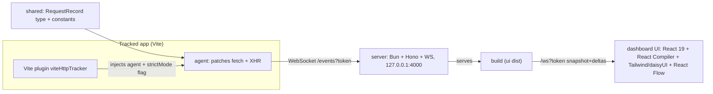
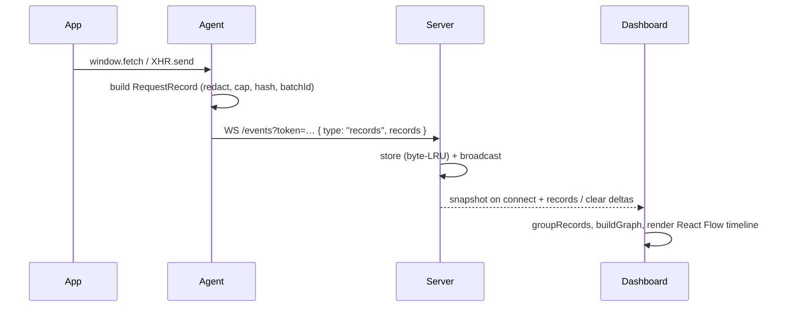

# vite-http-tracker

A developer-experience tool that captures the HTTP requests a frontend app makes (the same traffic you see in the browser Network panel) and renders them as an interactive timeline on a separate port.

The tool intercepts `fetch`/`XMLHttpRequest` in the running app, sends each request to a sidecar server, and shows a timeline of the app's HTTP events — including Strict-Mode duplicate detection and parallel-batch grouping — without requiring code changes.

## Features

- Captures `fetch` and `XMLHttpRequest` traffic: method, URL, status, timing, headers, and (size-capped + redacted) request/response bodies.
- Runs as a sidecar on its own port (`4000`), independent from the tracked app's dev server.
- Renders a chronological HTTP request timeline, orientable horizontally or vertically, with animated arrows showing event order.
- Detects **React Strict-Mode double-invocation**: identical requests fired back-to-back are collapsed into one node with a `×2` badge and a "likely strict mode" label.
- Detects **parallel batches** (`Promise.all`/`Promise.allSettled` / same-turn calls): requests started in the same turn are marked `⚡×N` with a dashed border.
- Filters by method/status/URL, and an inspector panel shows full headers / body / timing per request.
- Zero-config opt-in: a Vite plugin auto-injects the agent into a dev build; a CLI starts the server.
- A small development status button appears in plugin-enabled apps and links back to the dashboard.
- Local-first: no external service or persistent storage. The server binds to `127.0.0.1`, requires a shared token, and holds a bounded in-memory history.

## Architecture



### Data flow



The agent can also be wired up manually in a Vite app — `import { initAgent } from "vite-http-tracker/agent"` — when you want capture without the plugin's auto-inject.

## Packages

| Package            | Responsibility                                                                                                                           |
| ------------------ | ---------------------------------------------------------------------------------------------------------------------------------------- |
| `packages/shared`  | `RequestRecord` type + constants (caps, redaction tokens, dedup/batch windows, defaults).                                                |
| `packages/agent`   | Browser library. Patches `fetch`/`XMLHttpRequest`, captures records, streams over WebSocket with a ring buffer + reconnect + ack replay. |
| `packages/server`  | Bun + Hono + native WebSocket. Ingests records, byte-LRU store, broadcasts to dashboards, serves the UI, CLI `vite-http-tracker`.        |
| `packages/ui`      | React 19 dashboard: React Flow timeline, filters, inspector, dedup/batch logic.                                                          |
| `packages/plugin`  | Vite plugin `viteHttpTracker()`: auto-injects the agent into the dev build and detects Strict Mode from source.                          |
| `apps/react-app`   | Sample React 19 app (per-scenario buttons) used to exercise the tool.                                                                    |
| `apps/vue-app`     | Sample Vue 3 app used to manually verify Vite injection.                                                                                 |
| `apps/solid-app`   | Sample Solid app used to manually verify Vite injection.                                                                                 |
| `apps/svelte-app`  | Sample Svelte 5 app used to manually verify Vite injection.                                                                              |
| `apps/preact-app`  | Sample Preact app used to manually verify Vite injection.                                                                                |
| `apps/vanilla-app` | Plain TypeScript Vite app used to verify framework-independent injection.                                                                |

## Getting started

Prerequisites: [Bun](https://bun.sh) >= 1.4.

```bash
bun install
```

Run in two terminals:

```bash
# 1) tracker server + dashboard (served at :4000)
bun run packages/server/src/cli.ts --no-open

# 2) the sample app (served at :5173)
bun run --cwd apps/react-app dev
```

Open the dashboard at <http://localhost:4000/?token=dev> and the sample at <http://localhost:5173>. In the sample, click a scenario (e.g. `Chain`) to emit HTTP calls; watch them appear on the dashboard timeline.

The default token is `dev` for local development. If you change it with `--token`, use the same value in the dashboard URL and in the Vite plugin configuration. The token is required for both agent ingest and dashboard WebSocket connections.

The repository also includes Vite fixtures for Vue, Solid, Svelte, Preact, and vanilla TypeScript. Start any fixture with `bun run --cwd apps/<name> dev`; they use ports `5174` through `5178` respectively. These are intended for manual browser checks of plugin injection and request capture across Vite frontend stacks.

To start the tracker and a fixture together, use `bun run dev:all:<fixture>` where `<fixture>` is `react`, `vue`, `solid`, `svelte`, `preact`, or `vanilla`.

### Which package should I use?

#### I want the most plug-and-play setup. What should I install?

Install only `vite-http-tracker` as a development dependency. It includes the
Vite plugin, browser agent, tracker server, CLI, and dashboard:

```bash
npm install --save-dev vite-http-tracker
```

Then add `viteHttpTracker()` to `vite.config.ts` and run the CLI in a second
terminal. This is the recommended setup for almost every Vite application:

```ts
import { defineConfig } from "vite";
import { viteHttpTracker } from "vite-http-tracker/plugin";

export default defineConfig({
  plugins: [viteHttpTracker()],
});
```

```bash
bunx vite-http-tracker --no-open
```

Open <http://localhost:4000/?token=dev> and start your Vite app. No application
code changes are required.

### Runtime prerequisite: Bun

Bun is required to run the tracker server and CLI:

```bash
bun --version # 1.4 or newer
```

The application being inspected does not need to use Bun. It can continue to
use npm, pnpm, Yarn, or Bun for its own Vite development workflow. Installing
the package also does not require Bun, but the local sidecar started with
`vite-http-tracker` does because the server uses Bun's runtime and WebSocket
server.

#### When should I import `vite-http-tracker/plugin`?

Use `vite-http-tracker/plugin` in `vite.config.ts` when you want automatic
injection into the Vite development page. This is the normal integration and
the only import needed for the plug-and-play setup.

#### When should I import `vite-http-tracker/agent`?

Use `vite-http-tracker/agent` only when you need to initialize the browser
agent yourself, for example in a custom build tool, a non-standard Vite entry,
or when automatic injection is disabled with `autoInject: false`.

#### When should I use the server or CLI?

Use the `vite-http-tracker` CLI to start the local sidecar and dashboard:

```bash
bunx vite-http-tracker --no-open
```

You do not need to import `vite-http-tracker/server` for the normal setup. Use
that subpath only when embedding the server into another Bun-based tool or
when you need to call `startServer()` programmatically.

#### Do I need `@vite-http-tracker/*` packages?

No. The `@vite-http-tracker/agent`, `@vite-http-tracker/plugin`,
`@vite-http-tracker/server`, and `@vite-http-tracker/shared` packages are
workspace implementation packages. For an application consuming the published
library, install `vite-http-tracker` instead.

### Install as a development dependency

`vite-http-tracker` is a development tool. Install it as a `devDependency` in
the Vite application you want to inspect:

```bash
# npm
npm install --save-dev vite-http-tracker

# pnpm
pnpm add --save-dev vite-http-tracker

# Yarn
yarn add --dev vite-http-tracker

# Bun
bun add --dev vite-http-tracker
```

The package is intended to be used locally while developing. It is not
injected into production builds: the Vite plugin uses `apply: "serve"`.

### Use on your own Vite app

Add the plugin to `vite.config.ts` (or `vite.config.js`):

```ts
import { defineConfig } from "vite";
import react from "@vitejs/plugin-react";
import { viteHttpTracker } from "vite-http-tracker/plugin";

export default defineConfig({
  plugins: [
    react(),
    viteHttpTracker({
      serverUrl: "http://localhost:4000",
      token: "dev",
    }),
  ],
});
```

Start the sidecar in another terminal:

```bash
bunx vite-http-tracker --no-open
# or: npx vite-http-tracker --no-open (Bun must be installed)
# or: pnpm vite-http-tracker --no-open (Bun must be installed)
# or: yarn vite-http-tracker --no-open (Bun must be installed)
```

Then start the Vite app as usual and open the dashboard at
<http://localhost:4000/?token=dev>. The plugin injects the browser agent into
the development page automatically, so no application code changes are
required.

The `token` must be the same in the plugin configuration, the CLI, and the
dashboard URL. If `serverUrl` is omitted, the agent uses the current page host
and port `4000`:

```ts
viteHttpTracker({ token: "dev" });
```

For non-React Vite apps, omit the framework plugin and keep
`viteHttpTracker()` in the `plugins` array.

### Optional: initialize the agent manually

If automatic injection is not suitable, disable it and initialize the agent
from application code:

```ts
// vite.config.ts
viteHttpTracker({ autoInject: false, token: "dev" });
```

```ts
import { initAgent } from "vite-http-tracker/agent";

const cleanups = initAgent({
  serverUrl: "http://localhost:4000",
  token: "dev",
});

if (import.meta.hot) {
  import.meta.hot.dispose(() => {
    for (const cleanup of cleanups) cleanup();
  });
}
```

### What is included in the published package

The npm package contains the plugin, browser agent, server/CLI, shared runtime
files, and the built dashboard. The repository's test applications under
`apps/` are development fixtures only and are excluded from the published
package. The package is assembled by `bun run build:publish` and can be
inspected before release with:

```bash
bun run build:publish
npm pack --dry-run
```

## How to use

### For humans: end-to-end walkthrough

1. **Install** dependencies: `bun install`.
2. **Start the tracker** (terminal 1): `bun run packages/server/src/cli.ts --no-open`, then open the dashboard at `http://localhost:4000/?token=dev`.
3. **Start your app** (terminal 2): `npm run dev` (or the sample, `bun run --cwd apps/react-app dev`), then load it in a browser.
4. **Capture**: the injected agent starts streaming each request to the dashboard as your app runs. You don't need to click anything.
5. **Pick a call**: click a node to open the inspector on the right. It shows:
   - **Query params** — the request URL's query string, as a parsed key/value table.
   - **Request / Response headers** — full header tables.
   - **Request / Response body** — auto-parsed into a collapsible tree when it is JSON (objects, arrays, and even stringified JSON nested inside); form-encoded bodies become a key/value list; anything else shows the raw text with a `Structure / Raw` toggle. `truncated`, `streaming`, and `opaque` bodies are flagged with a banner.
   - **Copy as cURL** — the sticky button at the bottom copies a runnable `curl` command (method, headers, body) and shows a "cURL copied!" toast.
6. **Narrow the view**: filter by method / status / URL substring; flip orientation with `→`/`↓`; show/hide the timeline arrows; use zoom and fit-view to frame the flow; **Clear** empties the server buffer.

#### Troubleshooting

- **Dashboard says "offline"** — the server isn't running, or the token/protocol don't match. Start `bun run packages/server/src/cli.ts` and keep the `?token=dev` in the dashboard URL.
- **No calls appear** — the agent isn't injected. For dev, confirm `viteHttpTracker()` is in `vite.config.ts`, or call `initAgent()` manually. The plugin is dev-only (`apply: "serve"`) — it does not inject during `vite build`.
- **Bodies show as `opaque`** — the call is cross-origin and page JS can't read the response (CORS). DevTools is CORS-exempt; page code is not.
- **WSL2** — open the dashboard via `localhost:<port>` forwarding, not the WSL IP.

## Reading the timeline

- **Timeline:** requests are ordered by start time — earlier calls to the _left_ (horizontal) or _top_ (vertical) — and connected by animated arrows. `→`/`↓` toggles orientation.
- **`×2` badge:** Strict-Mode duplicate (identical `method`+`url`+body within 200ms) collapsed to one node; labeled "likely strict mode" when the app builds with Strict Mode enabled. Click to expand the duplicate list in the inspector.
- **`⚡×N` badge + dashed border:** parallel batch — calls started in the same turn (≤2ms apart, before any of them resolved), i.e. `Promise.all`/`Promise.allSettled`. These are not chained (no arrow).
- **Status pill** reflects the response class (green 2xx / yellow 3xx / red 4xx+). Each node also shows duration and response size.
- **Filters** (method / status / URL substring) narrow the timeline; **Clear** empties the buffer via the server.

### What the timeline means

This is an interactive timeline of HTTP requests, ordered chronologically and
enriched with heuristics for duplicate detection and parallel grouping.

An arrow means that one request was observed before another. It does not prove
that the later request depended on the earlier one, that the application
waited for it, or that one caused the other. The browser does not expose enough
information for the agent to reconstruct application-level causality reliably.

Duplicate and parallel labels are also timing heuristics, not guarantees.

## Configuration

`viteHttpTracker(options)` (plugin):

| Option          | Default             | Description                                                                    |
| --------------- | ------------------- | ------------------------------------------------------------------------------ |
| `serverUrl`     | page host + `:4000` | Tracker server URL. If omitted, the agent derives the host from the page.      |
| `token`         | `dev`               | Shared auth token. Required on every ingest/upgrade path.                      |
| `autoInject`    | `true`              | Whether to inject the agent into the dev build.                                |
| `showIndicator` | `true`              | Whether the injected dev agent shows the connection button in the tracked app. |
| `captureStreamMessages` | `false` | Whether to add every SSE/WebSocket message to the timeline. Lifecycle events remain captured. |
| `maxStreamEventsPerConnection` | `100` | Maximum SSE/WebSocket messages captured per connection when message capture is enabled. |

CLI `vite-http-tracker`:

| Flag        | Default      | Description                     |
| ----------- | ------------ | ------------------------------- |
| `--port`    | `4000`       | Dashboard/ingest port.          |
| `--token`   | `dev`        | Shared token.                   |
| `--no-open` | open browser | Do not auto-open the dashboard. |

UI can point at a different server via the `ws` query param (for example, `?token=dev&ws=ws%3A%2F%2Flocalhost%3A9999%2Fws%3Ftoken%3Ddev`) or the `VITE_HTTP_TRACKER_URL` env var.

## How detection works (heuristics)

- **Dedup:** the agent tags each record with `requestHash` and `strictMode`; the UI groups identical `(method, url, hash)` started within `200ms` (`DUPLICATE_WINDOW_MS`) into one node. Canonical = the surviving/last request.
- **Batch:** the agent assigns a `batchId` to requests whose `startTime` is within `2ms` (`BATCH_WINDOW_MS`) of the previous one; the UI counts members to show `⚡×N`.
- These are timing heuristics — the agent cannot observe the `Promise.all` object itself, so "batch" means "started in the same turn", and "duplicate" means "immediately repeated".

## Limitations

- **Dev-tools parity is partial.** DevTools is CORS-exempt; page JavaScript is not. Cross-origin calls the app cannot read are captured as metadata only (`opaque`). The tool is strictly less capable than the Network panel for response bodies.
- **Streaming / non-serializable bodies** (`ReadableStream`, `FormData`, `Blob`) are not captured. SSE/WebSocket lifecycle events are captured, while individual stream messages are disabled by default and can be enabled with `captureStreamMessages`.
- **Dev-only injection.** The Vite plugin has `apply: "serve"` — it injects the agent only in dev, not in production builds.
- **WSL networking.** The server binds `127.0.0.1`. In WSL2, access it via `localhost` forwarding (Windows browser → WSL), not the WSL IP, unless the server binds a non-loopback interface.
- **Local-only security.** The default server is intended for local development. Keep the token private, and do not expose the server beyond the loopback interface without adding an explicit security boundary.

## Agent guide

`AGENTS.md` is the authoritative map (architecture, invariants, conventions). This section is the short version an AI agent should read before changing code.

**Model:** `RequestRecord` in `packages/shared/src/types.ts` is the single canonical record type, flowing agent → server → UI.

| Change                                      | Where                                                                                           |
| ------------------------------------------- | ----------------------------------------------------------------------------------------------- |
| New record field                            | add to `RequestRecord` in `shared`, populate it in the `agent` capture path, surface it in `ui` |
| Graph behavior (dedup/batches/edges/layout) | pure functions in `ui/src/graph.ts` + `graph.test.ts` — keep React out of `graph.ts`            |
| Server behavior (endpoint/store/CLI flag)   | `server/src/server.ts`, `store.ts`, `cli.ts`, mirrored in `server.test.ts` / `e2e.test.ts`      |
| Plugin behavior (injection/config)          | `plugin/src/index.ts` (plugin is `apply: "serve"`, so verify with `vite dev`, not `vite build`) |
| Sample scenarios                            | `apps/react-app/src/App.tsx`                                                                    |

**Commands:**

```bash
bun test                                          # all tests (Bun runner)
bunx tsc --noEmit -p packages/<pkg>/tsconfig.json  # typecheck one package
bunx oxlint packages apps                          # lint (oxlint)
bunx oxfmt --write packages apps                   # format (oxfmt)
bun run --cwd packages/ui build                    # rebuild the dashboard bundle
```

**Invariants to preserve:**

- Server binds `127.0.0.1` only.
- Token required on every ingest (`POST /events`) and every WS upgrade (`/events`, `/ws`).
- Agent must append `?token=<token>` to its WS connect URL.
- Caps: body `500_000` bytes, store `128 MB`, agent ring buffer `10_000` records, dedup window `200 ms`, batch window `2 ms`.
- Sensitive headers/fields (`authorization`, `cookie`, `set-cookie`, `x-api-key`, `password`, `secret`, …) redacted to `[REDACTED]`.
- `crypto.randomUUID()` must go through `newId()` in `capture.ts` (env-safe).
- Deduplication and parallel grouping are timing heuristics, not guarantees; timeline arrows represent chronological order, not causality.

**Conventions:**

- Lint/format via `oxlint` + `oxfmt` — no ESLint/Prettier.
- Comments only when the "why" is non-obvious.
- Explicit types on exports; no `any`; `import type` for type-only imports; import with a `.js` extension.
- React Compiler via `react({ compiler: true })` — do not add `babel: { plugins: ['babel-plugin-react-compiler'] }`.
- happy-dom is registered per test file, not via a global `bunfig.toml` preload.
- Workspace exports point at `.ts` sources for local development; `bun run build:publish` generates the npm package in `dist/`.

## Development

```bash
bun test                    # run all tests (Bun test runner)
bunx tsc --noEmit -p packages/<pkg>/tsconfig.json   # typecheck one package
bunx oxlint packages apps   # lint (oxlint)
bunx oxfmt --write packages apps  # format (oxfmt)
bun run build:ui            # build the dashboard bundle (served by the server)
bun run packages/server/src/cli.ts --no-open   # run the server directly
bun run build:publish       # build the publishable package in dist/
NPM_CONFIG_CACHE=/tmp/npm-cache npm pack  # inspect the npm tarball
```

To publish a release, create and publish a GitHub Release. The publish workflow builds the package and publishes it to npm with provenance. Configure the npm package's GitHub Actions trusted publisher before the first release.

Each package has its own `tsconfig.json` (extends `tsconfig.base.json`). The dashboard UI is built with Vite 8 + the native React Compiler (Oxc). `@vitejs/plugin-react` v6 with `babel: { plugins: [...] }` is **not** used — that config only works on the old Babel toolchain.
