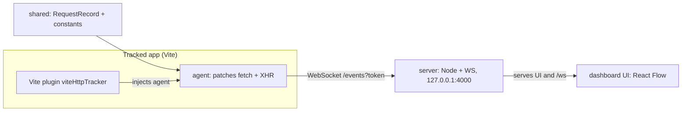
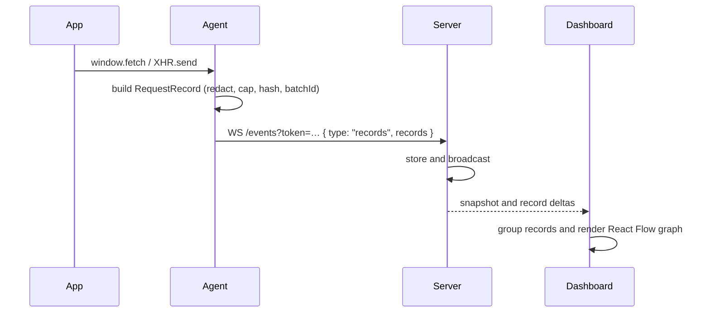

# vite-http-tracker

Vite development tool that captures browser `fetch`/`XMLHttpRequest` traffic and displays it as a chronological React Flow graph.

The Vite plugin injects the browser agent during `vite dev` and starts a local server for the dashboard and captured records.

## Installation

Install the published package as a development dependency:

```bash
# npm
npm install --save-dev vite-http-tracker

# pnpm
pnpm add --save-dev vite-http-tracker

# Yarn
yarn add --dev vite-http-tracker

# Bun
bun add --dev vite-http-tracker
```

## Plug-and-play setup

Add the plugin to `vite.config.ts`:

```ts
import { defineConfig } from "vite";
import { viteHttpTracker } from "vite-http-tracker/plugin";

export default defineConfig({
  plugins: [viteHttpTracker()],
});
```

Start the Vite application normally and open the route printed in the Vite terminal:

```text
http://127.0.0.1:4000/?token=dev
```

The default token is `dev`. No second command or application code changes are required. The plugin applies only to Vite development builds (`apply: "serve"`).

## Which package should I use?

### I want the normal Vite integration

Install `vite-http-tracker` and import `vite-http-tracker/plugin`. This is the recommended integration.

### I need manual browser-agent initialization

Import `vite-http-tracker/agent` when automatic injection is disabled or when the app is initialized by another build tool:

```ts
import { initAgent } from "vite-http-tracker/agent";

const cleanups = initAgent({
  serverUrl: "http://localhost:4000",
  token: "dev",
});

if (import.meta.hot) {
  import.meta.hot.dispose(() => {
    for (const cleanup of cleanups) cleanup();
  });
}
```

Disable automatic injection when using this mode:

```ts
viteHttpTracker({ autoInject: false, token: "dev" });
```

### I need to embed the server

Import `vite-http-tracker/server` only when embedding the tracker in another Node-based tool. The `@vite-http-tracker/*` workspace packages are implementation packages. Consumers should install `vite-http-tracker`.

## Configuration

```ts
import { defineConfig } from "vite";
import { viteHttpTracker } from "vite-http-tracker/plugin";

export default defineConfig({
  plugins: [
    viteHttpTracker({
      serverUrl: "http://localhost:4000",
      token: "dev",
      port: 4000,
      autoInject: true,
      showIndicator: true,
      captureStreamMessages: false,
      maxStreamEventsPerConnection: 100,
    }),
  ],
});
```

| Option | Default | Description |
| --- | --- | --- |
| `serverUrl` | page host + `:4000` | Tracker server URL. |
| `token` | `dev` | Shared token for the agent, server and dashboard. |
| `port` | `4000` | Local dashboard and ingest port. |
| `autoInject` | `true` | Inject the agent into the Vite dev page. |
| `showIndicator` | `true` | Show the agent connection indicator in the tracked app. |
| `captureStreamMessages` | `false` | Add individual SSE/WebSocket messages to the timeline. Lifecycle events are always captured. |
| `maxStreamEventsPerConnection` | `100` | Maximum stream messages captured per connection. |

The server binds to `127.0.0.1` and stops automatically when Vite stops.

## Dashboard

The dashboard provides:

- method, status, URL, timing, headers and body inspection;
- method/status/URL filters;
- horizontal and vertical orientations;
- chronological edges with cross-domain routing;
- React Strict Mode duplicate grouping;
- same-turn parallel batch grouping;
- MiniMap, zoom, fit view and recenter controls;
- timeline Replay for inspecting the graph at request timestamps;
- cURL generation from a selected request.

## Reading the timeline


- Nodes are ordered by `startTime`: left-to-right in horizontal mode and top-to-bottom in vertical mode.
- `×N` groups identical `(method, URL, body hash)` requests observed within `200ms`.
- `⚡×N` marks requests started within the same `2ms` batch window.
- Edges represent observation order, not application causality.
- Replay uses the actual request `startTime` values. The graph state at a playhead is `startTime <= playhead`.

## Architecture



### Data flow



## Detection and limits

- Request/response bodies are capped at `500,000` bytes.
- The server stores up to `128 MB` in memory.
- The agent ring buffer holds up to `10,000` records.
- Duplicate window: `200ms`.
- Batch window: `2ms`.
- Sensitive headers and fields are redacted to `[REDACTED]`.
- `FormData`, `Blob`, `ArrayBuffer` and `ReadableStream` bodies are not serialized.
- Opaque/CORS responses may expose metadata without a readable body.
- Stream lifecycle events are captured by default; individual messages are opt-in.

Duplicate and batch detection are timing heuristics. They do not prove React Strict Mode, `Promise.all`, dependency or causality.

## Troubleshooting

### Dashboard is offline

Check the Vite terminal for the dashboard route and open it in the browser.

### No requests appear

Check that:

- `viteHttpTracker()` is in `vite.config.ts`;
- the app is running with `vite dev`, not `vite build`;
- the plugin token matches the token in the dashboard route;
- the browser page can connect to `localhost:4000`.

### Bodies are marked opaque

The page JavaScript cannot read the response because of CORS or an opaque fetch. DevTools may still display more information because it is not subject to the page's CORS restrictions.

### WSL2

Open the dashboard through `localhost` forwarding. The server intentionally binds only to `127.0.0.1`.

## Development

The repository uses Bun workspaces. Test applications under `apps/` are development fixtures and are excluded from the published package.

```bash
bun install
bun test
bunx tsc --noEmit -p packages/ui/tsconfig.json
bunx oxlint packages apps
bun run --cwd packages/ui build
```

To run the included React fixture (the plugin starts the tracker automatically):

```bash
bun run --cwd apps/react-app dev
```

To inspect the publishable package:

```bash
bun run build:publish
npm_config_cache=/tmp/vite-http-tracker-npm-cache npm pack --dry-run
```

The package is published by GitHub Actions after a GitHub Release. npm Trusted Publishing must be configured for `.github/workflows/publish.yml`.
