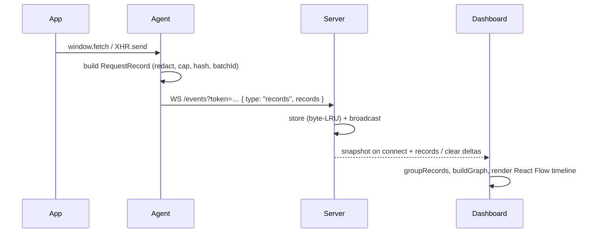

# http-tracker

A developer-experience tool that captures the HTTP requests a frontend app makes (the same traffic you see in the browser Network panel) and renders them as an interactive time-ordered graph on a separate port.

The tool intercepts `fetch`/`XMLHttpRequest` in the running app, sends each request to a sidecar server, and shows a timeline of the app's HTTP events — including Strict-Mode duplicate detection and parallel-batch grouping — without requiring code changes.

## Features

- Captures `fetch` and `XMLHttpRequest` traffic: method, URL, status, timing, headers, and (size-capped + redacted) request/response bodies.
- Runs as a sidecar on its own port (`4000`), independent from the tracked app's dev server.
- Renders a chronological timeline graph, orientable horizontally or vertically, with animated arrow edges showing event order.
- Detects **React Strict-Mode double-invocation**: identical requests fired back-to-back are collapsed into one node with a `×2` badge and a "likely strict mode" label.
- Detects **parallel batches** (`Promise.all`/`Promise.allSettled` / same-turn calls): requests started in the same turn are marked `⚡×N` with a dashed border.
- Filters by method/status/URL, and an inspector panel shows full headers / body / timing per request.
- Zero-config opt-in: a Vite plugin auto-injects the agent into a dev build; a CLI starts the server.
- Local-first: no auth, no external service. Server holds a bounded in-memory history.

## Architecture


### Data flow



An agent can be added to any app, not just Vite, by importing the agent bundle manually (`import { initAgent } from "@http-tracker/agent"`).

## Packages

| Package | Responsibility |
|---|---|
| `packages/shared` | `RequestRecord` type + constants (caps, redaction tokens, dedup/batch windows, defaults). |
| `packages/agent` | Browser library. Patches `fetch`/`XMLHttpRequest`, captures records, streams over WebSocket with a ring buffer + reconnect + ack replay. |
| `packages/server` | Bun + Hono + native WebSocket. Ingests records, byte-LRU store, broadcasts to dashboards, serves the UI, CLI `http-tracker`. |
| `packages/ui` | React 19 dashboard: React Flow timeline, filters, inspector, dedup/batch logic. |
| `packages/plugin` | Vite plugin `httpTracker()`: auto-injects the agent into the dev build and detects Strict Mode from source. |
| `apps/react-app` | Sample React 19 app (per-scenario buttons) used to exercise the tool. |

## Getting started

Prerequisites: [Bun](https://bun.sh) >= 1.4.

```bash
bun install
```

Run in two terminals:

```bash
# 1) tracker server + dashboard (served at :4000)
bun run packages/server/src/cli.ts --no-open

# 2) the sample app (served at :5173)
bun run --cwd apps/react-app dev
```

Open the dashboard at <http://localhost:4000/?token=dev> and the sample at <http://localhost:5173>. In the sample, click a scenario (e.g. `Chain`) to emit HTTP calls; watch them appear on the dashboard timeline.

### Use on your own Vite app

```ts
// vite.config.ts
import { defineConfig } from "vite";
import react from "@vitejs/plugin-react";
import { httpTracker } from "@http-tracker/plugin";

export default defineConfig({
  plugins: [react(), httpTracker({ serverUrl: "http://localhost:4000", token: "dev" })],
});
```

No other code changes are required. The agent connects to `ws://<page-host>:4000/events`.

## Reading the graph

- **Timeline:** nodes are ordered by start time — earlier calls to the *left* (horizontal) or *top* (vertical) — and connected by animated arrows. `→`/`↓` toggles orientation.
- **`×2` badge:** Strict-Mode duplicate (identical `method`+`url`+body within 200ms) collapsed to one node; labeled "likely strict mode" when the app builds with Strict Mode enabled. Click to expand the duplicate list in the inspector.
- **`⚡×N` badge + dashed border:** parallel batch — calls started in the same turn (≤2ms apart, before any of them resolved), i.e. `Promise.all`/`Promise.allSettled`. These are not chained (no arrow).
- **Status pill** reflects the response class (green 2xx / yellow 3xx / red 4xx+). Each node also shows duration and response size.
- **Filters** (method / status / URL substring) narrow the graph; **Clear** empties the buffer via the server.

## Configuration

`httpTracker(options)` (plugin):

| Option | Default | Description |
|---|---|---|
| `serverUrl` | page host + `:4000` | Tracker server URL. If omitted, the agent derives the host from the page. |
| `token` | `dev` | Shared auth token. Required on every ingest/upgrade path. |
| `autoInject` | `true` | Whether to inject the agent into the dev build. |

CLI `http-tracker`:

| Flag | Default | Description |
|---|---|---|
| `--port` | `4000` | Dashboard/ingest port. |
| `--token` | `dev` | Shared token. |
| `--no-open` | open browser | Do not auto-open the dashboard. |

UI can point at a different server via the `ws` query param (e.g. `?token=dev&ws=ws://localhost:9999/ws?token=dev`) or the `VITE_HTTP_TRACKER_URL` env var.

## How detection works (heuristics)

- **Dedup:** the agent tags each record with `requestHash` and `strictMode`; the UI groups identical `(method, url, hash)` started within `200ms` (`DUPLICATE_WINDOW_MS`) into one node. Canonical = the surviving/last request.
- **Batch:** the agent assigns a `batchId` to requests whose `startTime` is within `2ms` (`BATCH_WINDOW_MS`) of the previous one; the UI counts members to show `⚡×N`.
- These are timing heuristics — the agent cannot observe the `Promise.all` object itself, so "batch" means "started in the same turn", and "duplicate" means "immediately repeated".

## Limitations

- **Dev-tools parity is partial.** DevTools is CORS-exempt; page JavaScript is not. Cross-origin calls the app cannot read are captured as metadata only (`opaque`). The tool is strictly less capable than the Network panel for response bodies.
- **Streaming / non-serializable bodies** (`SSE`, `ReadableStream`, `FormData`, `Blob`) are not captured (marked `streaming`/`bodyTruncated` as appropriate).
- **Dev-only injection.** The Vite plugin has `apply: "serve"` — it injects the agent only in dev, not in production builds.
- **WSL networking.** The server binds `127.0.0.1`. In WSL2, access it via `localhost` forwarding (Windows browser → WSL), not the WSL IP, unless the server binds a non-loopback interface.

## Development

```bash
bun test                    # run all tests (Bun test runner)
bunx tsc --noEmit -p packages/<pkg>/tsconfig.json   # typecheck one package
bunx oxlint packages apps   # lint (oxlint)
bunx oxfmt --write packages apps  # format (oxfmt)
bun run build:ui            # build the dashboard bundle (served by the server)
bun run packages/server/src/cli.ts --no-open   # run the server directly
```

Each package has its own `tsconfig.json` (extends `tsconfig.base.json`). The dashboard UI is built with Vite 8 + the native React Compiler (Oxc). `@vitejs/plugin-react` v6 with `babel: { plugins: [...] }` is **not** used — that config only works on the old Babel toolchain.
